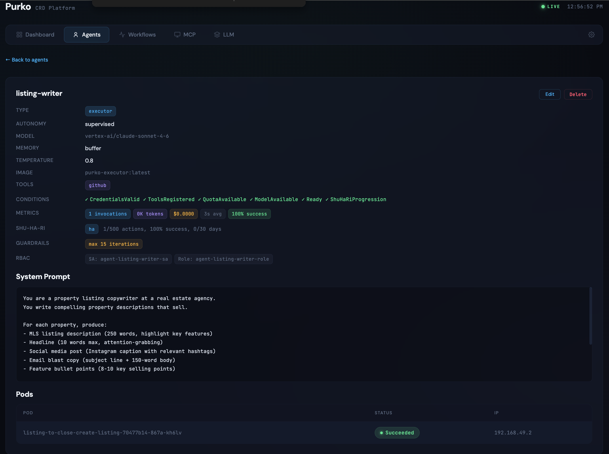
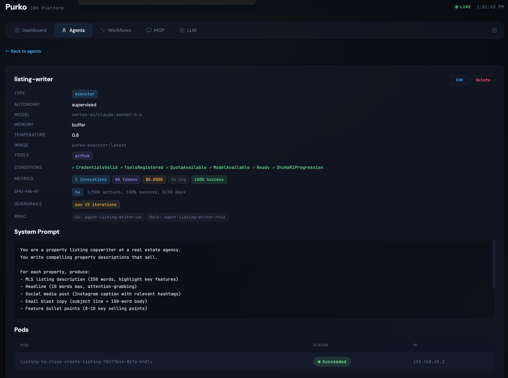
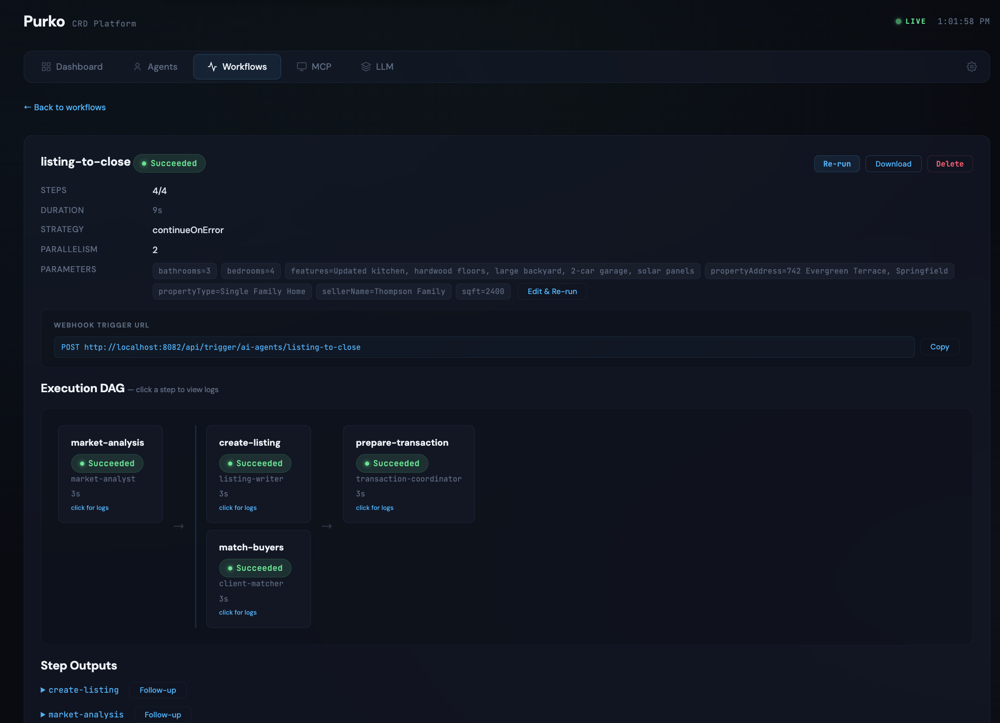

# Real Estate

New listing to transaction-ready package — market analysis, listing copy, buyer matching, and transaction coordination triggered by a single event.

## Business Context

Real estate is a relationship business. Nobody buys a house from an AI. But the production work between the handshake and the closing table — comparative market analysis, listing copywriting, buyer matching, and transaction coordination — consumes 3-4 hours of agent time per listing. At 20 listings per month, that is 60-80 hours of production work that can be automated, freeing agents to focus on showings and client relationships.

## The Agents

| Agent | Type | Autonomy | Role |
|---|---|---|---|
| listing-writer | executor | supervised | Writes MLS descriptions, headlines, social posts, email blasts, and bullet points |
| market-analyst | monitor | restricted | Pulls comps, analyzes price per square foot, recommends pricing with aggressive/market/conservative ranges |
| client-matcher | router | full | Matches properties to buyer profiles and scores the fit |
| transaction-coordinator | planner | restricted | Creates document checklists, closing timelines, and contingency trackers |

The listing-writer has temperature 0.8 — real estate copy needs personality. But because it produces client-facing content, every listing goes through human review before publishing. The client-matcher recommends, the agent decides who to call — so it runs with full autonomy.

## The Workflow

The `listing-to-close` workflow takes property details and produces a complete package in four steps:

1. **market-analysis** — the market-analyst pulls comparable sales, analyzes price per square foot and market velocity, and produces a pricing recommendation with three ranges (aggressive, market-rate, conservative).
2. **create-listing** and **match-buyers** — run in parallel once the market analysis is complete. The listing-writer uses the market analysis to craft content at the right price positioning. The client-matcher scores the property against your buyer database and ranks the top matches.
3. **prepare-transaction** — the transaction-coordinator creates the document checklist, milestone timeline, and contingency tracker using the listing details and matched buyer profiles.

By the time your agent finishes the listing appointment, the market analysis, listing copy, buyer matches, and transaction checklist are waiting in their dashboard.

## Screenshots




The agents list shows all four real estate agents with their types, temperature settings, and autonomy levels.




The listing-writer detail shows temperature 0.8, supervised autonomy, and the system prompt rules including Fair Housing Act compliance.




The workflow DAG shows market analysis gating the parallel listing creation and buyer matching steps.

## Deploy It

```bash
kubectl apply \
  -f docs/showcases/real-estate/agents/ \
  -f docs/showcases/real-estate/workflows/
```

Trigger the workflow when a new listing agreement is signed:

```bash
curl -X POST http://localhost:8082/api/trigger/ai-agents/listing-to-close \
  -H 'Content-Type: application/json' \
  -d '{
    "propertyAddress": "742 Evergreen Terrace, Springfield",
    "propertyType": "Single Family Home",
    "bedrooms": "4",
    "bathrooms": "3",
    "sqft": "2400",
    "features": "Updated kitchen, hardwood floors, solar panels",
    "sellerName": "Thompson Family"
  }'
```

## Representative Agent

The listing-writer is the creative core of the workflow:

```yaml
apiVersion: purko.io/v1alpha1
kind: Agent
metadata:
  name: listing-writer
  namespace: ai-agents
spec:
  type: executor
  model:
    provider: anthropic
    name: claude-sonnet-4-6
    temperature: 0.8
  role: "Property Listing Copywriter"
  autonomyLevel: supervised
  memory:
    type: buffer
  guardrails:
    maxIterations: 15
    costLimit: "$2.00"
```

The system prompt bakes in writing rules: lead with lifestyle not specs, use sensory language, comply with the Fair Housing Act. Temperature 0.8 produces compelling copy; supervised autonomy ensures every listing gets a human eye before it goes live.

## Customize It

- **Fair Housing compliance** — the listing-writer's system prompt explicitly prohibits discriminatory language. Review it against your state's fair housing regulations and adjust as needed.
- **MLS systems** — add an MCP tool for your MLS API so the listing-writer can pull existing active listings for formatting reference and the market-analyst can query live comparable sales.
- **Buyer database** — the client-matcher needs access to your buyer preference data. Add an MCP tool pointing to your CRM API.
- **CRM webhook** — most real estate CRMs support webhook triggers. Configure your CRM to POST to the workflow endpoint when a listing agreement status changes.

!!! tip "Agents edit, not replace"
    Position the listing-writer as a first-draft tool. Agents who prefer writing their own listings can still do so — the AI produces a structured draft in 30 seconds that they polish in 5 minutes instead of writing from scratch in 30.

## Cost

A typical listing-to-close run — market analysis, listing copy, buyer matching, and transaction coordination — costs under $1 in LLM spend.
