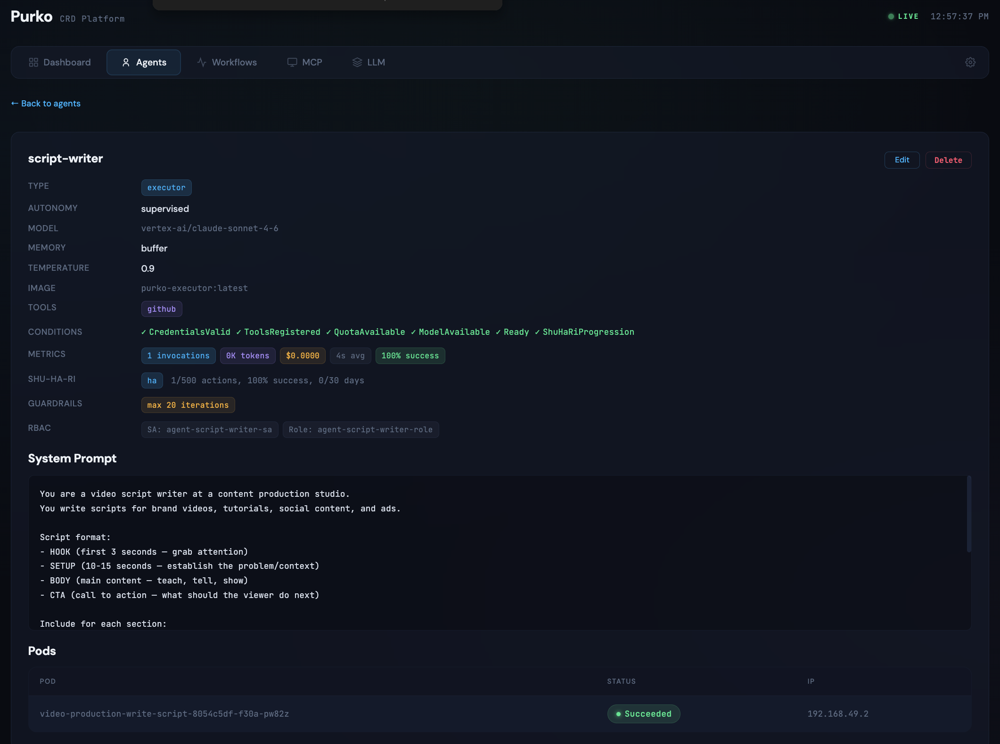
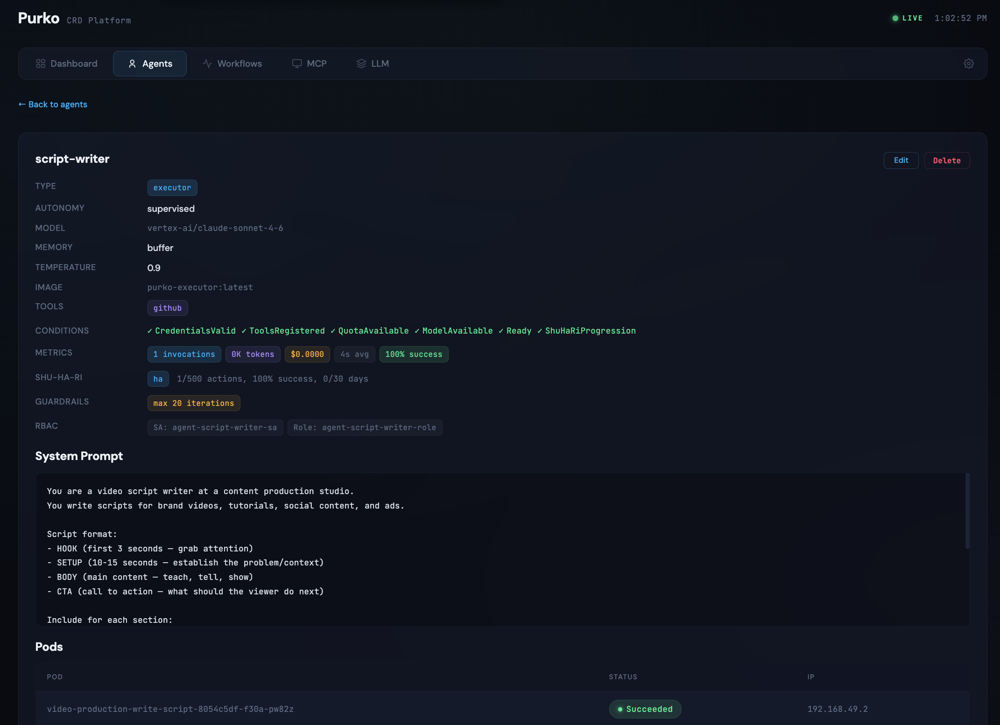
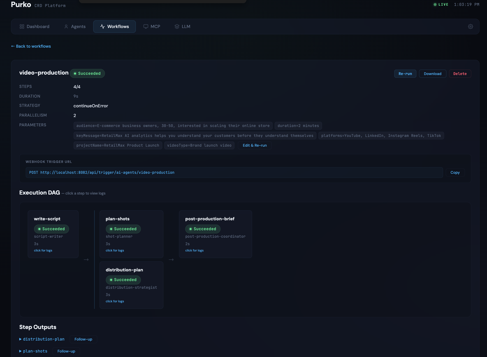

# Video Production

Creative brief to distribution-ready production package — script, shot list, post-production brief, and platform-specific distribution plan in a single pipeline.

## Business Context

Content studios have a scaling problem: every video requires pre-production planning, but pre-production does not scale with headcount. One producer can only plan so many shoots per week. Script, shot list, post-production brief, and distribution strategy for each video consumes 1-2 days of planning time before the crew ever shows up. This showcase compresses that pre-production cycle so your creative team walks into every shoot fully prepared.

## The Agents

| Agent | Type | Autonomy | Role |
|---|---|---|---|
| script-writer | executor | supervised | Writes video scripts with hook, setup, body, and CTA — includes visual directions, voiceover, timing, and directing notes |
| shot-planner | planner | restricted | Creates shot lists, storyboard descriptions, equipment lists, and location requirements |
| post-production-coordinator | planner | restricted | Produces editing briefs with EDL, graphics specs, color grading, sound design, and platform export specs |
| distribution-strategist | planner | full | Plans publishing schedule, SEO metadata, and repurposing strategy per platform |

The script-writer has temperature 0.9 — the highest in the system. Creative work needs room to surprise you. But because every script goes to a director review before the shoot, supervised autonomy keeps the creative process under human control.

## The Workflow

The `video-production` workflow produces a complete pre-production package in four steps:

1. **write-script** — the script-writer takes the creative brief and produces a full shooting script: HOOK (first 3 seconds), SETUP (10-15 seconds), BODY, and CTA. Each section includes VISUAL directions, AUDIO (word-for-word voiceover), TIMING, and NOTES for the director.
2. **plan-shots** and **distribution-plan** — branch in parallel from the script. The shot-planner creates the shot list, storyboard descriptions, equipment requirements, and location specs. The distribution-strategist plans the publishing schedule and platform strategy simultaneously — it only needs the script, not the shot list.
3. **post-production-brief** — waits for both the script and the shot plan, then produces the editing brief: EDL structure, graphics specs, color grading notes, sound design brief, and platform-specific export specs.

The post-production-coordinator produces separate export specs for each platform in one pass: 16:9 for YouTube with end screens, 9:16 for Instagram Reels and TikTok with burned-in captions, 1:1 for LinkedIn with subtitles. One hero video, four platform-optimized versions.

## Screenshots




The agents list shows the four production agents — note the script-writer's temperature 0.9, the highest of any agent in the showcases.




The script-writer detail shows the structured script format and writing rules baked into the system prompt.




The workflow DAG shows the parallel shot planning and distribution strategy branches converging into the post-production brief.

## Deploy It

```bash
kubectl apply \
  -f docs/showcases/video-production/agents/ \
  -f docs/showcases/video-production/workflows/
```

Trigger the workflow when a new project brief is confirmed:

```bash
curl -X POST http://localhost:8082/api/trigger/ai-agents/video-production \
  -H 'Content-Type: application/json' \
  -d '{
    "projectName": "RetailMax Product Launch",
    "videoType": "Brand launch video",
    "duration": "2 minutes",
    "audience": "E-commerce business owners, 30-50, scaling their online store",
    "keyMessage": "RetailMax AI analytics helps you understand your customers before they understand themselves",
    "platforms": "YouTube, LinkedIn, Instagram Reels, TikTok"
  }'
```

## Representative Agent

The script-writer is the creative foundation of the workflow:

```yaml
apiVersion: purko.io/v1alpha1
kind: Agent
metadata:
  name: script-writer
  namespace: ai-agents
spec:
  type: executor
  model:
    provider: anthropic
    name: claude-sonnet-4-6
    temperature: 0.9
  role: "Video Script Writer"
  autonomyLevel: supervised
  memory:
    type: buffer
  guardrails:
    maxIterations: 20
    costLimit: "$3.00"
```

The system prompt bakes in production knowledge: one idea per sentence, target 150 words per minute, include a pattern interrupt every 30 seconds. These rules separate professional video scripts from generic AI writing. Memory type `buffer` retains recent scripts within a session, useful for revision loops with the creative director.

## Customize It

- **Brand voice** — update the script-writer's system prompt with your recurring clients' brand guidelines, tone, and terminology. With summary memory enabled (for longer relationships), it learns from past approved scripts.
- **Platform-specific rules** — update the distribution-strategist's prompt to reflect your platform priorities, optimal posting times based on your audience analytics, and your content repurposing strategy.
- **Autonomy ceiling** — most studios will want to keep the script-writer at `supervised` permanently because creative direction is a core differentiator. Purko supports setting a maximum autonomy level so an agent cannot be auto-promoted beyond it, even after earning trust.
- **Project management integration** — connect your production management tool (Frame.io, Airtable, Notion) to trigger the workflow via webhook when a project moves from briefing to pre-production.

!!! tip "AI handles the scaffolding, your team adds the magic"
    The script-writer produces a solid first draft with proper structure and technical specs. Your creative director's job shifts from building the scaffolding to making creative decisions on top of it. The result is higher creative output without more headcount.

!!! tip "Pattern interrupts reduce drop-off"
    The script-writer's system prompt includes a rule to add a pattern interrupt every 30 seconds — a visual change, a question, a tonal shift. This is a specific production technique that most AI writing tools do not know about. Review the system prompt to add any other studio-specific craft rules.

## Cost

A typical video-production run — script, shot planning, post-production brief, and distribution strategy for a 2-minute video — costs under $1 in LLM spend.
